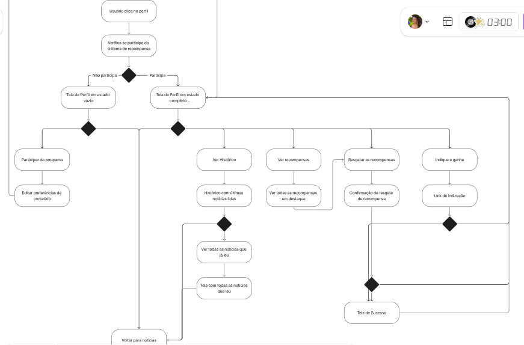
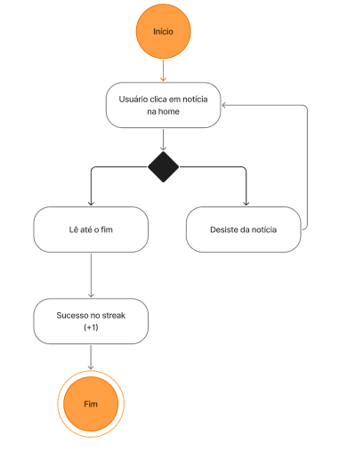
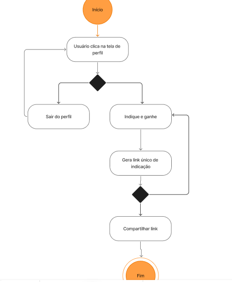

# 📌 Projeto SJCC — Fidelização Digital (Segundo Clique)

## 👥 Equipe
- **Victor Nadler (Product Owner)** 
- **Nádia Bordoni (SM/Design)** 
- **Clara Albuquerque (Devenvolvedora)** 
- **Augusto Venâncio (Desenvolvedor)** 
- **Caio Marques (Desenvolvedor)**
- **Júlio Sales (Desenvolvedor)** 
- **Danilo de Melo (Desenvolvedor)** 
- **Júlia Camara (Design)** 
- **Maria Luísa Muniz (Design)** 

## 📰 Produto (o que estamos construindo)
Uma solução para **aumentar a permanência e incentivar o “segundo clique”** nas páginas de notícia do SJCC, melhorando a experiência na página de matéria e sugerindo conteúdos relevantes de forma inteligente.

## 🔎 Problema
Após mudanças de algoritmo, houve **redução de relevância em busca**, **queda de audiência** e **menor recall de marca**. Nosso foco é recuperar retenção e engajamento.

## 🎯 Público-alvo
Leitores recorrentes e ocasionais dos portais do SJCC que chegam por busca/redes e têm potencial de consumir 2+ conteúdos/visita.

## 📊 Métricas de Sucesso
- ↑ **Páginas por sessão**  
- ↑ **Tempo na página / sessão**  
- ↑ **CTR** para conteúdo recomendado  
- ↓ **Taxa de rejeição** nas páginas de matéria

## 📌 Backlog e Organização

Todas as entregas do time são feitas em quadros do FigJam, separados por entregas e acompanhados de um cronograma, e também no ClickUp, onde organizamos o prazo das entregas, a prioridade e os responsáveis por cada atividade.

- [Quadro Geral de Histórias de Usuário no FigJam](https://www.figma.com/board/W0RYzOMUy0OIylgtdrFQ3c/Quadro-Geral?node-id=488-3696&p=f&t=8X4nOILNXaKc3dhj-0) 
- [Cronograma de Entregas no FigJam](https://www.figma.com/board/W0RYzOMUy0OIylgtdrFQ3c/Quadro-Geral?node-id=30-113&p=f&t=8X4nOILNXaKc3dhj-0)

## ⚙️ O Issue/Bug Tracker foi atualizado para refletir a realidade atual do projeto.
As issues representam histórias de usuário, bugs e tarefas de documentação, cada uma com rótulos (labels) e milestones específicas, permitindo o acompanhamento claro da evolução das sprints.

🟢 Done: funcionalidades concluídas e bugs resolvidos

🟠 In Progress: itens em desenvolvimento

🔵 To Do: tarefas planejadas para execução

📋 O quadro de issues inclui entregas anteriores (Entregas 02 e 03) e a Sprint atual (Sprint 10), garantindo rastreabilidade entre as iterações do projeto.

📸 Print do quadro de Issues no GitHub:

O print acima evidencia o uso de labels (história, bug, documentação, design, organização), diferentes status e milestones correspondentes às sprints do projeto.

## 📊 Diagrama de Atividades

O diagrama abaixo representa o fluxo principal de interação do usuário no sistema, desde o cadastro até a recomendação de novas notícias.  
Ele foi elaborado para demonstrar de forma visual como as ações do usuário se conectam às respostas do sistema, servindo como base para a prototipação e desenvolvimento.
- [Diagrama de atividades](https://www.figma.com/board/W0RYzOMUy0OIylgtdrFQ3c/Quadro-Geral?node-id=662-2324&p=f&t=MPGOHOK1pskjaefL-0)

## ✏️ Prototipação Lo-Fi

Fizemos nossa prototipação lo-fi por meio do Figma, traduzindo bem nossa ideia para algo mais simples e fácil de assimilar
- [Protopação Lo-Fi](https://www.figma.com/board/W0RYzOMUy0OIylgtdrFQ3c/Quadro-Geral?node-id=488-3699&p=f&t=5smKvGZQzuXuZdXC-0)

### Sketchs e Storyboards

Aqui nos produzimos 10 histórias de usuário por meio de Storyboards, cada quadrado se refera a uma tela que o usuário passa e interage

História 1

História 2

Histórias 3 e 4

Histórias 5, 6 e 7

Histórias 8, 9 e 10

## 🎥 Screencast do Protótipo

O vídeo abaixo apresenta o fluxo principal do protótipo Lo-Fi desenvolvido para o SJCC, destacando o objetivo de incentivar o **segundo clique** no portal.

## 🎥 [QA] Teste de Sistema

O vídeo abaixo apresenta a tela de perfil, de recompensas e de histórico no figma e a tela de perfil implementada no front.
[![Assista ao vídeo no YouTube]](https://youtu.be/OIJaiMSNTZA)

## 🗂️ Quadro da Sprint e Backlog

Abaixo estão os registros do quadro atualizado da sprint e do backlog, evidenciando as histórias de usuário e bugs planejados, em andamento e já concluídos.

### Quadro da Sprint

### Backlog

