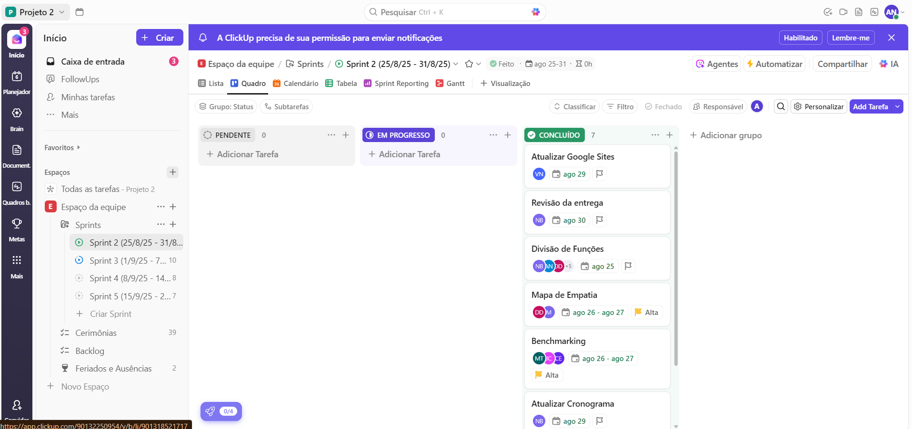

# 📌 Projeto SJCC — Fidelização Digital (Segundo Clique)

## 👥 Equipe
- **Victor Nadler (Product Owner)** — [GitHub](#) · [LinkedIn](#)
-  **Nádia Bordoni (SM/Design)** — [GitHub](#) · [LinkedIn](#)
- **Augusto Venâncio (Desenvolvedor)** — [GitHub](https://github.com/gutovenancio)
- **Clara Albuquerque (Devenvolvedora)** — [GitHub](#) · [LinkedIn](#)
- **Caio Marques (Desenvolvedor)** — [GitHub](#) · [LinkedIn](#)
- **Júlio Sales (Desenvolvedor)** — [GitHub](#) · [LinkedIn](#)
- **Danilo de Melo (Desenvolvedor)** — [GitHub](#) · [LinkedIn](#)
- **Júlia Camara (Design)** — [GitHub](#) · [LinkedIn](#)
- **Malu Muniz (Design)** — [GitHub](#) · [LinkedIn](#)

## 📰 Produto (o que estamos construindo)
Uma solução para **aumentar a permanência e incentivar o “segundo clique”** nas páginas de notícia do SJCC, melhorando a experiência na página de matéria e sugerindo conteúdos relevantes de forma inteligente.

### Problema
Após mudanças de algoritmo, houve **redução de relevância em busca**, **queda de audiência** e **menor recall de marca**. Nosso foco é recuperar retenção e engajamento.

### Proposta de Solução (versão 1 do MVP)
-escrever opções

### Público-alvo
Leitores recorrentes e ocasionais dos portais do SJCC que chegam por busca/redes e têm potencial de consumir 2+ conteúdos/visita.

### Métricas de Sucesso
- ↑ **Páginas por sessão**  
- ↑ **Tempo na página / sessão**  
- ↑ **CTR** para conteúdo recomendado  
- ↓ **Taxa de rejeição** nas páginas de matéria

## 📝 Histórias de Usuário
As histórias de usuário definidas para o projeto estão disponíveis [neste documento](histórias-usuário.md).  

## 📌 Backlog
Abaixo, o print do quadro de backlog no ClickUp:  

